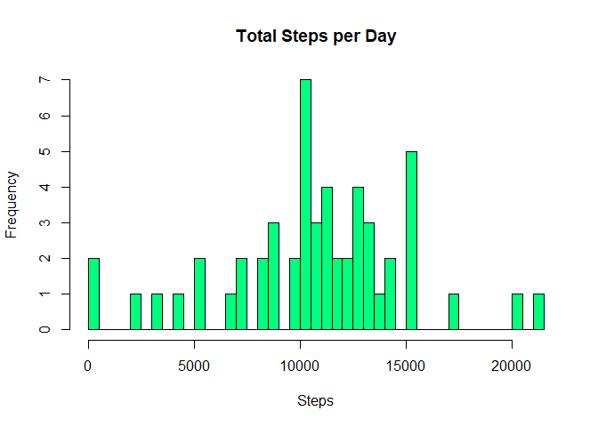
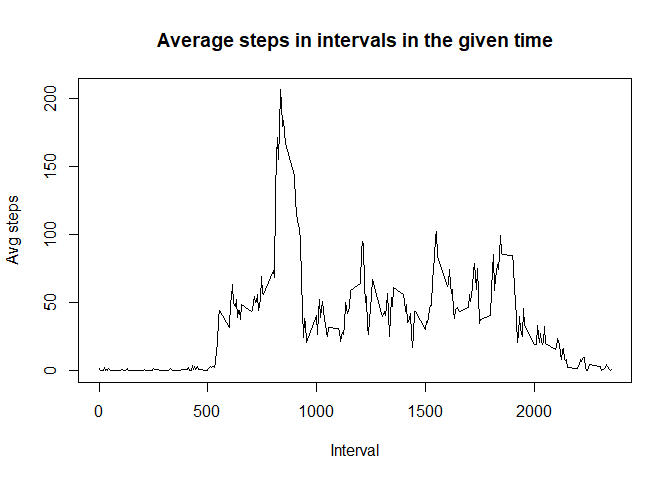
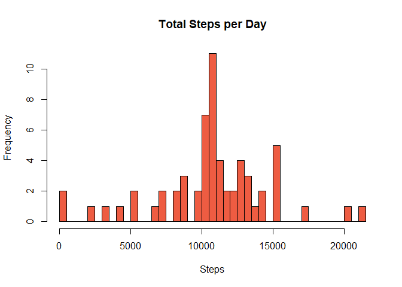
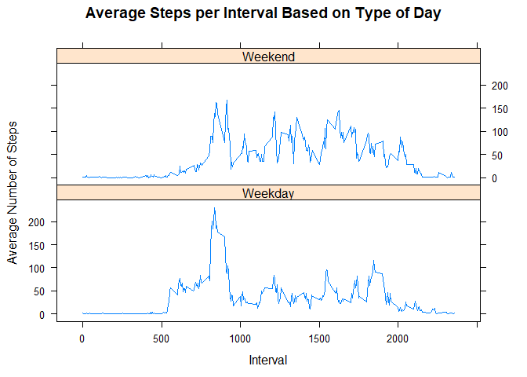

## Loading and preprocessing the data

```r
unzip("activity.zip")
activity_data <- read.csv("activity.csv")
head(activity_data)
```

```
##   steps       date interval
## 1    NA 2012-10-01        0
## 2    NA 2012-10-01        5
## 3    NA 2012-10-01       10
## 4    NA 2012-10-01       15
## 5    NA 2012-10-01       20
## 6    NA 2012-10-01       25
```

```r
str(activity_data)
```

```
## 'data.frame':	17568 obs. of  3 variables:
##  $ steps   : int  NA NA NA NA NA NA NA NA NA NA ...
##  $ date    : Factor w/ 61 levels "2012-10-01","2012-10-02",..: 1 1 1 1 1 1 1 1 1 1 ...
##  $ interval: int  0 5 10 15 20 25 30 35 40 45 ...
```

```r
tail(activity_data)
```

```
##       steps       date interval
## 17563    NA 2012-11-30     2330
## 17564    NA 2012-11-30     2335
## 17565    NA 2012-11-30     2340
## 17566    NA 2012-11-30     2345
## 17567    NA 2012-11-30     2350
## 17568    NA 2012-11-30     2355
```

```r
activity_data <- transform(activity_data,date = as.Date(date))                           
str(activity_data)
```

```
## 'data.frame':	17568 obs. of  3 variables:
##  $ steps   : int  NA NA NA NA NA NA NA NA NA NA ...
##  $ date    : Date, format: "2012-10-01" "2012-10-01" ...
##  $ interval: int  0 5 10 15 20 25 30 35 40 45 ...
```


## What is mean total number of steps taken per day?

```r
sum_daily <- aggregate(activity_data$steps ~ activity_data$date, FUN=sum, )
head(sum_daily)
```

```
##   activity_data$date activity_data$steps
## 1         2012-10-02                 126
## 2         2012-10-03               11352
## 3         2012-10-04               12116
## 4         2012-10-05               13294
## 5         2012-10-06               15420
## 6         2012-10-07               11015
```

```r
colnames(sum_daily) <- c("DATE","STEPS")
hist(sum_daily$STEPS, xlab="Steps",ylab = "Frequency",breaks = 50,col = "springgreen", main = "Total Steps per Day")
```

<!-- -->

```r
mean <- mean(sum_daily$STEPS)
print(mean)
```

```
## [1] 10766.19
```

```r
med <- median(sum_daily$STEPS)
print(med)
```

```
## [1] 10765
```

## What is the average daily activity pattern?

```r
avg_steps <- tapply(activity_data$steps, activity_data$interval, mean, na.rm=TRUE, simplify=T)
head(avg_steps)
```

```
##         0         5        10        15        20        25 
## 1.7169811 0.3396226 0.1320755 0.1509434 0.0754717 2.0943396
```

```r
plot(as.integer(names(avg_steps)),main = "Average steps in intervals in the given time",xlab = "Interval",ylab = "Avg steps",avg_steps,type = "l")
```

<!-- -->

```r
avg_steps_df <- data.frame(interval=as.integer(names(avg_steps)), avg=avg_steps)
print(avg_steps_df[avg_steps_df$avg ==max(avg_steps),1])
```

```
## [1] 835
```

## Imputing missing values

```r
sum(is.na(activity_data$steps))
```

```
## [1] 2304
```

```r
nas <- is.na(activity_data$steps)
activity_data$steps[nas] <- avg_steps[as.character(activity_data$interval[nas])]
str(activity_data)
```

```
## 'data.frame':	17568 obs. of  3 variables:
##  $ steps   : num  1.717 0.3396 0.1321 0.1509 0.0755 ...
##  $ date    : Date, format: "2012-10-01" "2012-10-01" ...
##  $ interval: int  0 5 10 15 20 25 30 35 40 45 ...
```

```r
new_data <- activity_data

sum_daily_2 <- aggregate(new_data$steps ~ new_data$date, FUN=sum, )
head(sum_daily_2)
```

```
##   new_data$date new_data$steps
## 1    2012-10-01       10766.19
## 2    2012-10-02         126.00
## 3    2012-10-03       11352.00
## 4    2012-10-04       12116.00
## 5    2012-10-05       13294.00
## 6    2012-10-06       15420.00
```

```r
colnames(sum_daily_2) <- c("DATE","STEPS")
hist(sum_daily_2$STEPS, xlab="Steps",ylab = "Frequency",breaks = 50,col = "tomato2", main = "Total Steps per Day")
```

<!-- -->

```r
mean_2 <- mean(sum_daily_2$STEPS)
print(mean_2)
```

```
## [1] 10766.19
```

```r
med_2 <- median(sum_daily_2$STEPS)
print(med_2)
```

```
## [1] 10766.19
```

## Are there differences in activity patterns between weekdays and weekends?

```r
activity_data$week_factor <- ifelse(weekdays(activity_data$date) %in% c("Saturday", "Sunday"), "Weekend", "Weekday")
head(activity_data)
```

```
##       steps       date interval week_factor
## 1 1.7169811 2012-10-01        0     Weekday
## 2 0.3396226 2012-10-01        5     Weekday
## 3 0.1320755 2012-10-01       10     Weekday
## 4 0.1509434 2012-10-01       15     Weekday
## 5 0.0754717 2012-10-01       20     Weekday
## 6 2.0943396 2012-10-01       25     Weekday
```

```r
library(lattice) 
library(plyr)
n_data <- ddply(activity_data, .(interval, week_factor), summarize, avg = mean(steps))
xyplot(avg~interval|week_factor, data= n_data, type="l",  layout = c(1,2),
       main="Average Steps per Interval Based on Type of Day", 
       ylab="Average Number of Steps", xlab="Interval")
```

<!-- -->
